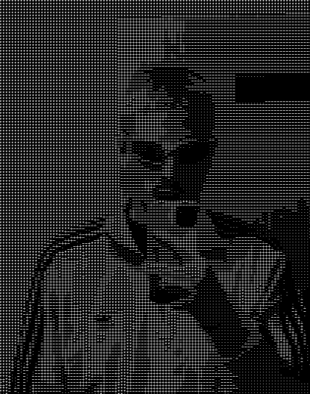

<div align=center>

### Hi there 👋

</br>

</br>

<div align=left>

```zsh
> neofetch
```

<div style="display:flex; align-items:center">


```
┌────────────── System Information ──────────────┐
  erikborsos@github
  ----------------------
  OS: macOS arm64
  Shell: zsh 5.9
  Resolution: 2560 x 1664
  CPU: Apple M2
  GPU: Apple M2
├─────────────── User Information ───────────────┤
  Uptime: 20 years, 6 months, 17 days
  Host: JKU Linz
  Kernel: Computer Science
  Languages:
  -----------
  Programming: Java, Go, TypeScript, ...
  Real: German, English, Hungarian, Romanian
  Hobbies:
  ---------
  Software: Music, Series, Anime
  Hardware: Gym
  Contact:
  ---------
  Email: erikborsos21@gmail.com
  LinkedIn: linkedin.com/in/erik-borsos-312683296/
  Discord: rajot
└────────────────────────────────────────────────┘
```

</div>

</div>

<br/>

## 💻 Tech Stack:

![git] ![github] ![docker] <br/>
![java] ![kotlin] ![go] ![js] ![ts] <br/>
![svelte] ![sveltekit] ![react] ![nextjs] <br/>
![tailwindcss] ![threejs] ![sh]

## 📊 GitHub Stats:

![stats]

## Top Languages

![langs]

## Contribution:

<br/> ![graph]

</div>

<!----------------------------------{ reference links }--------------------------------->

[stats]: https://github-readme-stats.vercel.app/api?username=erikborsos&show_icons=true&theme=dark&hide_border=false&include_all_commits=true&count_private=false
[langs]: https://github-readme-stats.vercel.app/api/top-langs/?username=erikborsos&theme=dark&hide_border=false&count_private=false&layout=compact&langs_count=10&hide=html,css,scss,less,stylus,shell,makefile,cmake,perl,php,blade,smarty,scss,less,stylus,shell,makefile,cmake,perl,php,blade,smarty,jupyter+notebook,

<!----------------------------------{ contribution stats }--------------------------------->

[graph]: https://github-readme-activity-graph.vercel.app/graph?username=erikborsos&theme=github-compact&hide_border=false&area=true

<!----------------------------------{ language badges }--------------------------------->

[git]: https://img.shields.io/badge/git-%23F05032.svg?style=for-the-badge&logo=git&logoColor=white
[github]: https://img.shields.io/badge/github-%23121011.svg?style=for-the-badge&logo=github&logoColor=white
[docker]: https://img.shields.io/badge/docker-%230db7ed.svg?style=for-the-badge&logo=docker&logoColor=white
[java]: https://img.shields.io/badge/java-%23ED8B00.svg?style=for-the-badge&logo=java&logoColor=white
[kotlin]: https://img.shields.io/badge/kotlin-%230095D5.svg?style=for-the-badge&logo=kotlin&logoColor=white
[go]: https://img.shields.io/badge/go-%2300ADD8.svg?style=for-the-badge&logo=go&logoColor=white
[js]: https://img.shields.io/badge/javascript-%23323330.svg?style=for-the-badge&logo=javascript&logoColor=%23F7DF1E
[ts]: https://img.shields.io/badge/typescript-%23007ACC.svg?style=for-the-badge&logo=typescript&logoColor=white
[svelte]: https://img.shields.io/badge/svelte-%23F7B93E.svg?style=for-the-badge&logo=svelte&logoColor=white
[sveltekit]: https://img.shields.io/badge/sveltekit-%23F24E1E.svg?style=for-the-badge&logo=svelte&logoColor=white
[react]: https://img.shields.io/badge/react-%2320232a.svg?style=for-the-badge&logo=react&logoColor=%2361DAFB
[nextjs]: https://img.shields.io/badge/next.js-%23000000.svg?style=for-the-badge&logo=next.js&logoColor=white
[tailwindcss]: https://img.shields.io/badge/tailwindcss-%2338B2AC.svg?style=for-the-badge&logo=tailwind-css&logoColor=white
[threejs]: https://img.shields.io/badge/threejs-%23000000.svg?style=for-the-badge&logo=three.js&logoColor=white
[sh]: https://img.shields.io/badge/sh-%23121011.svg?style=for-the-badge&logo=gnu-bash&logoColor=white
